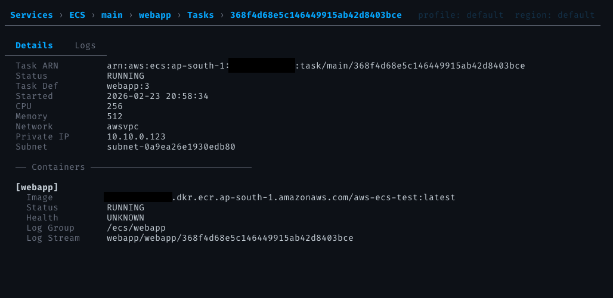
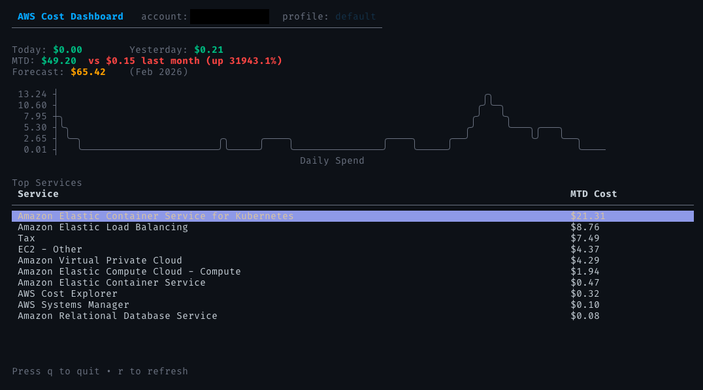

# aws-tui

> **WIP** — This project is under active development and not yet ready for general use.

A terminal UI for browsing and managing AWS resources, built with Go and [Bubble Tea](https://github.com/charmbracelet/bubbletea).

## Screenshots





## Features

- **Services Browser** — Browse AWS resources in an interactive TUI with drill-down navigation, filtering, and clipboard copy
- **EKS Dashboard** — k9s-inspired cluster dashboard with pod exec (native terminal with raw mode, SIGWINCH), log streaming, and port-forwarding — no kubectl required
- **Cost Dashboard** — View month-to-date spend per service with ASCII cost graphs

## Supported Services

| Service | What you can browse |
|---------|-------------------|
| **EC2** | Instances — name, type, state, IPs |
| **ECS** | Clusters → Services → Tasks → Logs, with auto-scaling config and deployment history |
| **VPC** | VPCs → Dashboard, Subnets, Security Groups, Route Tables, Internet Gateways, NAT Gateways |
| **EKS** | Clusters → Dashboard, Node Groups, Add-ons, Fargate Profiles, Access Entries, Pods, Services, Deployments, Service Accounts (IRSA) |
| **ECR** | Repositories → Images |
| **ELB** | Load Balancers → Listeners → Target Groups |
| **S3** | Buckets → Objects (prefix/folder navigation, file preview, download with progress) |
| **IAM** | Users → Policies/Groups, Roles → Policies/Trust Policy, Policies → Attached Entities |
| **Cost Explorer** | Month-to-date cost breakdown by service |

### EKS Operations

| Action | Key | Scope | Description |
|--------|-----|-------|-------------|
| Exec | `x` | Pods, Nodes | Interactive shell (prompts for command, defaults to `/bin/sh`) |
| Logs | `l` | Pods | Stream pod container logs with follow, search, and word wrap |
| Port Forward | `f` | Pods | Forward a local port to a pod (e.g. `8080:80`) |
| List Forwards | `F` | Pods, Services | View and manage active port-forward sessions |
| YAML Spec | `e` | All K8s tabs | View resource YAML with syntax highlighting and search |
| Namespace | `N` | K8s tabs | Filter by namespace or clear filter |
| Switch Tab | `Tab` / `1-8` | Cluster detail | Navigate between cluster detail tabs |

Multi-container pods show a container picker before exec/logs.

## Keybindings

| Key | Action |
|-----|--------|
| `Enter` | Select / drill down |
| `Esc` | Go back |
| `j/k` | Navigate up/down |
| `/` | Filter rows |
| `r` | Refresh data |
| `c` / `C` | Copy ID / ARN to clipboard |
| `?` | Toggle context-sensitive help |
| `q` | Quit (with confirmation) |

## Install

### Homebrew

```sh
brew install tasnimzotder/tap/aws-tui
```

## Usage

```sh
# Browse AWS services
awstui services

# View cost data
awstui cost
```

Flags:

```sh
awstui services -p <profile> -r <region>
awstui cost -p <profile>
```

Requires valid AWS credentials (via environment variables, `~/.aws/credentials`, or SSO).

## Build

```sh
go build -o awstui .
```

## Limitations

- **Mostly read-only** — No create, update, or delete operations; browsing only (exception: EKS pod exec and port-forwarding)
- **Single region** — Queries one region at a time (no cross-region aggregation)
- **Single account** — No multi-account or AWS Organizations support
- **Client-side pagination** — All resources are fetched at once then paginated locally; very large accounts may see slow initial loads
- **Limited service coverage** — Only the services listed above are supported; no Lambda, RDS, DynamoDB, etc.
- **No real-time updates** — Data is fetched on load; use `r` to manually refresh
- **Cost data scope** — Cost dashboard shows month-to-date only; no custom date ranges or historical trends
