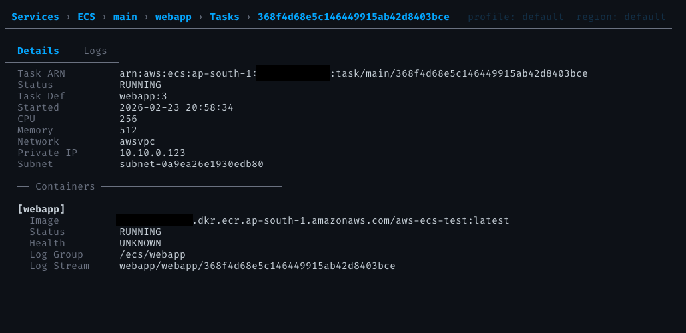
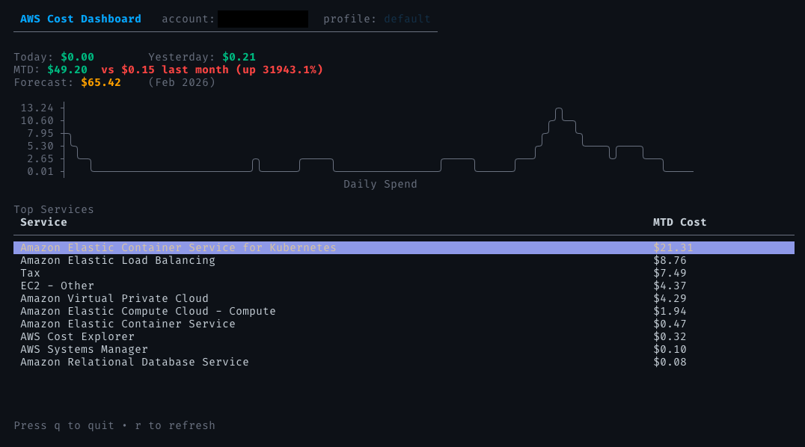

# aws-tui

A terminal UI for browsing AWS resources, built with Go and [Bubble Tea](https://github.com/charmbracelet/bubbletea).

## Screenshots





## Features

- **Dashboard** — Service health overview with status counts and at-a-glance indicators
- **Drill-down Navigation** — Stack-based routing: select a resource to see its detail, press `Esc` to go back
- **Filtering & Sorting** — Press `/` to filter any table, `s` to sort columns
- **Runtime Region & Profile Switching** — Press `R` / `P` to switch without restarting
- **Auto-refresh** — Configurable polling with adaptive intervals for active resources
- **Interactive Exec** — SSM sessions (EC2), ECS Exec (ECS tasks), and kubectl shell (EKS clusters)
- **Cost Explorer** — FinOps dashboard with unblended/amortized toggle, sparklines, budget bars, service changes, month navigation, and region breakdown

## Supported Services

| Service | What you can browse |
|---------|-------------------|
| **EC2** | Instances — state, type, AZ, IPs, security groups, volumes, tags. `x` to SSM into running instances |
| **ECS** | Clusters → Services → Tasks → Container detail. `x` to exec into running tasks |
| **EKS** | Clusters → Overview, Node Groups, Addons, Fargate Profiles, Access Entries. `x` to open kubectl shell |
| **VPC** | VPCs → Subnets, Security Groups, Route Tables, Internet Gateways, NAT Gateways |
| **ECR** | Repositories → Images with tags, size, and push timestamps |
| **ELB** | Load Balancers → Listeners → Target Groups with health status |
| **S3** | Buckets → Objects with prefix navigation |
| **IAM** | Users, Roles, Policies — attached entities, trust policies, group memberships |
| **Cost Explorer** | Monthly spend by service and region, daily charts, cost changes, forecasts |

### Exec Operations

| Service | Key | Scope | Command |
|---------|-----|-------|---------|
| EC2 | `x` | Instance detail (running) | `aws ssm start-session` |
| ECS | `x` | Task detail (running) | `aws ecs execute-command` |
| EKS | `x` | Cluster detail (active) | `aws eks update-kubeconfig` + interactive shell |

EC2 SSM requires the SSM Agent on the instance. ECS Exec requires `EnableExecuteCommand` on the service and `session-manager-plugin` installed locally.

### Cost Explorer

| Key | Action |
|-----|--------|
| `<` / `>` | Navigate months (up to 6 months back) |
| `m` | Toggle unblended / amortized cost metric |
| `[` / `]` | Switch tabs (Overview, Services, Regions, Daily, Changes) |
| `r` | Refresh |

## Keybindings

| Key | Action |
|-----|--------|
| `Enter` | Select / drill down |
| `Esc` | Go back |
| `j` / `k` | Navigate up / down |
| `/` | Filter rows |
| `s` | Sort column |
| `r` | Refresh data |
| `a` | Toggle auto-refresh |
| `R` | Switch AWS region |
| `P` | Switch AWS profile |
| `Ctrl+K` | Command palette |
| `?` | Toggle help |
| `q` | Quit |

## Install

### Homebrew

```sh
brew install tasnimzotder/tap/aws-tui
```

## Usage

```sh
awstui
```

Flags:

```sh
awstui -r <region> -p <profile>
```

Requires valid AWS credentials (via environment variables, `~/.aws/credentials`, or SSO).

## Build

```sh
go build -o awstui .
```

## Limitations

- **Read-only** — No create, update, or delete operations (exceptions: exec sessions)
- **Single region** — Queries one region at a time; switch with `R`
- **Single account** — No multi-account or AWS Organizations support
- **Limited service coverage** — Only the services listed above; no Lambda, RDS, DynamoDB, etc.
